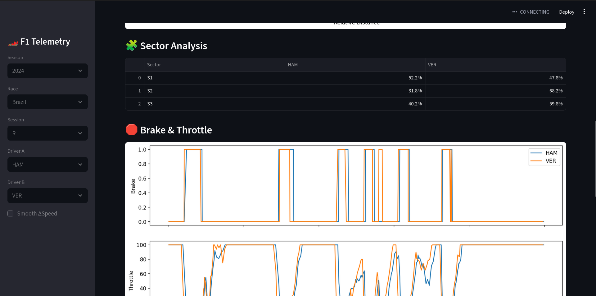

# 🏎️ F1 Telemetry Analysis in C


📋 Overview



Professional-grade Formula 1 telemetry analysis platform that combines low-level C processing, Python data extraction, and an interactive Streamlit dashboard to analyze, compare, and visualize driver performance using real F1 race data.

This project is designed with automotive embedded systems and motorsport engineering principles in mind, focusing on data pipelines, signal processing, telemetry interpretation, and performance analysis.

This project demonstrates:

✅ Multi-driver telemetry comparison (VER vs HAM)
✅ Speed delta analysis with interpolation
✅ Real-time state detection algorithm
✅ CSV parsing and processing in C
✅ Data extraction from F1 API (FastF1)
✅ Professional visualization and reporting
✅ Automotive data analysis skills

## 🎯 Key Features
1. Driver Comparison System

Compare telemetry between any two F1 drivers
Speed, throttle, and brake analysis side-by-side
Automatic best lap detection
Visual overlap comparison

2. Delta Analysis

Speed delta calculation with scipy interpolation
Percentage breakdown: who was faster where
Sector-by-sector analysis (3 sectors)
Top 5 advantage points for each driver

3. State Detection Algorithm
Identifies racing contexts in real-time:

🏁 Straights: Full throttle sections (short/medium/long)
🔄 Corners: Braking zones and low-speed sections
🚀 Corner Exits: Acceleration zones with lookahead prediction

4. Professional Output

High-resolution plots (300 DPI)
CSV exports for further analysis
Console statistics and breakdown
Analysis reports with insights

## 📷 Dashboard Features

Speed Comparison

Overlaid speed traces along lap distance

ΔSpeed Analysis

Positive → Driver A faster

Negative → Driver B faster

Sector Breakdown

Percentage dominance per sector

Track Map Visualization

Circuit plotted using X/Y telemetry

Colored by which driver is faster in each section

## 🛠️ Technologies

- **C**: Core processing and analysis
- **Python**: Data extraction via FastF1 library
- **CSV**: Data interchange format

## 📊 How It Works
```
1. Python extracts telemetry from F1 API
2. Data saved as CSV (speed, throttle, brake, position)
3. C program:
   - Parses CSV
   - Analyzes each point
   - Detects racing state
   - Exports results
```

## 📊 System Architecture
```
┌─────────────────────────────────────────────────────────┐
│                  F1 TELEMETRY PLATFORM                  │
└─────────────────────────────────────────────────────────┘

    [F1 API]
        │
        ▼
[FastF1 - Python]
        │
        ├── telemetry_VER.csv
        ├── telemetry_HAM.csv
        │
        ▼
[C Telemetry Analyzer]
        │
        ├── State detection
        ├── Signal classification
        └── Statistics
        │
        ▼
[Processed CSV Outputs]
        │
        ▼
[Streamlit Dashboard]
        ├── Speed & Delta plots
        ├── Sector analysis
        ├── Track map
        └── Interactive comparison
```

## ▶️ How to Run
1️⃣ Install dependencies
```sh
pip install -r requirements.txt

streamlit run app.py
```

## 📈 C Algorithm Logic
```c
IF (brake == 1 OR (throttle < 20 AND speed < 250))
    → CURVE
ELSE IF (brake == 0 AND throttle <= 95 AND speed_increasing)
    → CURVE_EXIT
ELSE IF (throttle > 95 AND throttle <= 98)
    → STRAIGHT (SHORT)
ELSE
    → STRAIGHT (MEDIUM/LONG)
```

## 📷 Sample Output
```
IN POSITION: 0.0234 -> SPEED: 187.34; THROTTLE: 45.23; BRAKE: 1
IN POSITION: 0.0456 -> SPEED: 201.12; THROTTLE: 78.45; BRAKE: 0
```

## 🎓 Learning Goals

This project is part of my journey to work in **automotive embedded systems** and **motorsport technology**, combining:
- Low-level programming (C)
- Data analysis
- Understanding of vehicle dynamics
- Real-world F1 telemetry

## 👤 Author

**Pedro Henrique Bonifácio da Rosa**  
Computer Engineering Student @ Unisinos  
Focused on: Automotive Embedded Systems | Motorsport Technology | Telemetry Analysis

📧 [pedrorosa.rb@gmail.com]  
🔗 [LinkedIn](https://www.linkedin.com/in/pedro-bonif%C3%A1cio-9869a9263/)  

## 📄 License

MIT License - Feel free to use this for learning!

---

⭐ **If you found this helpful, consider giving it a star!**

---
